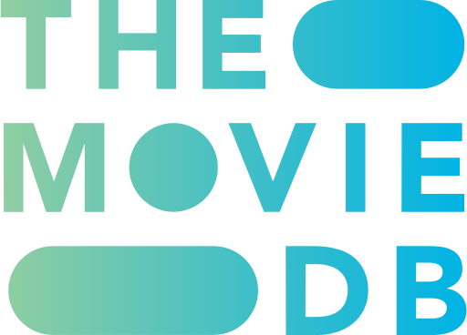
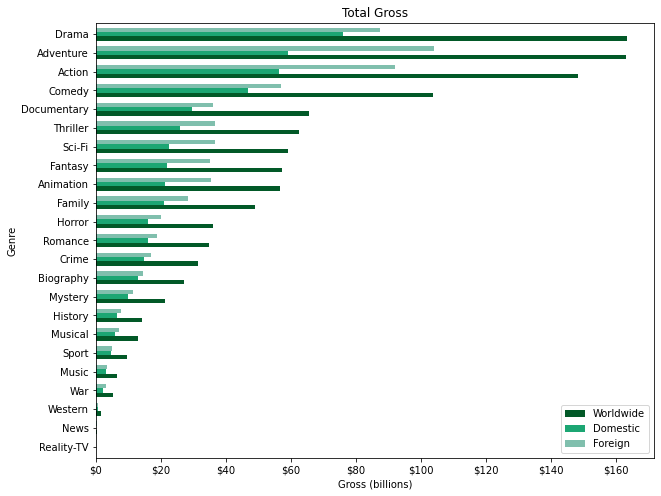
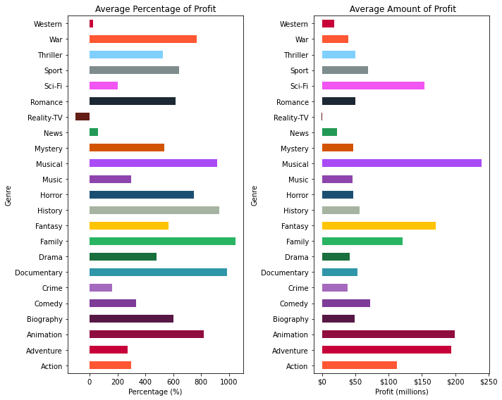
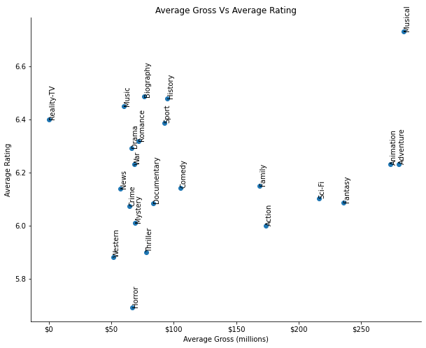

# Academy Xi Phase 1 Project

## Overview
This project is an opportunity to apply the concepts and techniques learned in Phase 1 with real world data. Through data analysis, this report will generate 3 key insights that will aid in the decision making of Microsoft's new movie studio. It is important to communicate visually and provide context to help Microsoft understand the large amount of data that is available to them. Finally, I will provide a recommendation based on the analysis I have generated.	

## Business Problem
Microsoft is exploring options to expand the services they provide. Given the success of other large corporate competitors in the video content space, Microsoft have decided to open their own movie studio. Given the lack of experience in an industry dominated by well-established brands, it is important to identify key metrics that Microsoft can build upon. A strong understanding of these metrics will help the studio choose a direction for success.

An important aspect for any business entering into a new industry is building an identity. What can Microsoft implement to differentiate themselves from their competitors? I have broken it down into 3 overarching directions
* Playing The Numbers - Maximise viewership by building upon genres that are trending
* Familiar Faces - Audiences will be attracted to people that have had long term success in the industry
* Stories Are Our Strength - Success is defined by being critically acclaimed and it begins with stories

For the purposes of this project, I will focus on insights regarding Playing The Numbers.

## Data Understanding
The data being used for this analysis have been gathered from well-known websites IMDb, Rotten Tomatoes and TMDB. Each website collects a large amount of information regarding movies in their own way including financial data, review scores and genre. Casting a wide net of data sets will provide a balanced insight, reflective of a big population given the size of the movie industry.

  
  
  

## Data Preparation
### Insight 1
A simple and great insight to start off with would be to explore which genre had the highest gross. The underlying concept here is that high gross sales equates to more people have viewed that genre of movie.
### Insight 2
A studio pouring a large budget into a movie project does not neccessarily equate to high gross sales in the box office. For Microsoft's newest studio, a reasonable budget is an important consideration. In the scenario of a movie flopping in these early stages would hurt Microsoft's reputation both in the short and long term.
### Insight 3
One of the many attributes that moviegoers look for to make the decision to watch a movie is its rating. As the studio produces more movies, maintaining high quality will become a challenge so the studio must focus on well performing genres for long term sustained success.

## Evaluation
For my evaluation, I want to identify the top 3 performing genres for each insight. This will help the studio identify key genres to focus on and hopefully identify a common well performing genre across all insights

### Insight 1

I specifically chose to order this bar graph by highest grossing to least grossing because it would be an easy way to identify the top genres. The top 3 by worldwide gross are **Drama, Adventure and Action**. I have also included the Domestic and Foreign and Gross numbers because it is important to note that the movie being produced should reach a global audience. For every genre, Foreign gross numbers were greater than the Domestic gross numbers. A movie that appeals to both the domestic and foreign audience can go a long way into the final gross numbers

### Insight 2

Budget plays a big part in the production of a movie. Ideally, Microsoft would not like to pour funds into a movie that could end up making a net loss. In order to identify, I modelled two graphs to identify the relationshop between budget and the profitability for each genre.

The Average Percentage of Profit graph indicates each genres ability to generate profit based on their budget. For example, if an action movie had a budget of $1 million, it would be able to produce 300% of profit which equates to $3 million. Therefore, a genre like musicals with a higher percentage can have a lower budget to reach the same profit.

However, the Average Percentage of Profit could be misleading if it is not seen in context with the Average Amount of Profit graph. This graph shows how much profit each genre actually made. A genre may have a high percentage to yield a high profit, as we can see in this graph as well as the Total Gross graph, that is not the case in physical sales.

For the Average Percentage of Profit graph, the top 3 genres are **Family, Documentary and Musical**. In general, these movies usually have a lower budget compared to other genres.

For the Average Amount of Profit graph, the top 3 genres are **Musical, Animation and Adventure**. Both the Musical and Animation genre are able to take advantage of their ability to make profit and generate high profit.

### Insight 3

One way to support the strong sales displayed in the Top Gross graph and generate long term success is through ratings. Audiences will use ratings as part of their decision making for watching a movie. Generating well rated movies could generate new/repeat viewers (meaning more gross/profit). The Average Gross Vs Average Rating graph helps identify which genres do both well and the top 3 are **Musicals, Adventure and Animation**.

## Conclusion
These are the top performers for each insight
+ Insight 1: Drama, Adventure and Action
+ Insight 2: Family, Documentary and Musical and Musical, Animation and Adventure
+ Insight 3: Musicals, Adventure and Animation

Based on these results, it is my recommendation that Microsoft's newest studio focus on releasing an **Adventure** movie. Although it requires a higher budget to yield a higher profit, it is still able to reach those high marks based on the gross sales. A middle of the pack genre rating but again, its ability to generate a high gross makes this a solid direction moving forward.

A surprising and well performing genre is musicals. Its total gross sales are in the bottom third but has great potential to generate profit and rate very well with audiences. If the studio is able to generate enough popularity for a musical movie, it could do very well.

Genres to avoid would be war and westerns. They do not perform well in any insight and are era specific. They most likely appeal to a smaller size of the wider audience.

## Further Exploration
For further exploration, I would like to explore the strength of covariance and correlation between the insights I have generated. It would provide a deeper context and allow the studio to be more confident in the direction they choose. When the studio makes a decision on a genre, the next insight to explore would be when in the year it would be best to release it.

Furthermore, given the extensive amount of data available, I would like to explore the other 2 overarching directions I mentioned at the beginning of this project, Familiar Faces and Stories Are Our Strength. Actors, directors and story all play a part in the production of a movie and I would like to explore how that relates to gross sales, budget and ratings.
